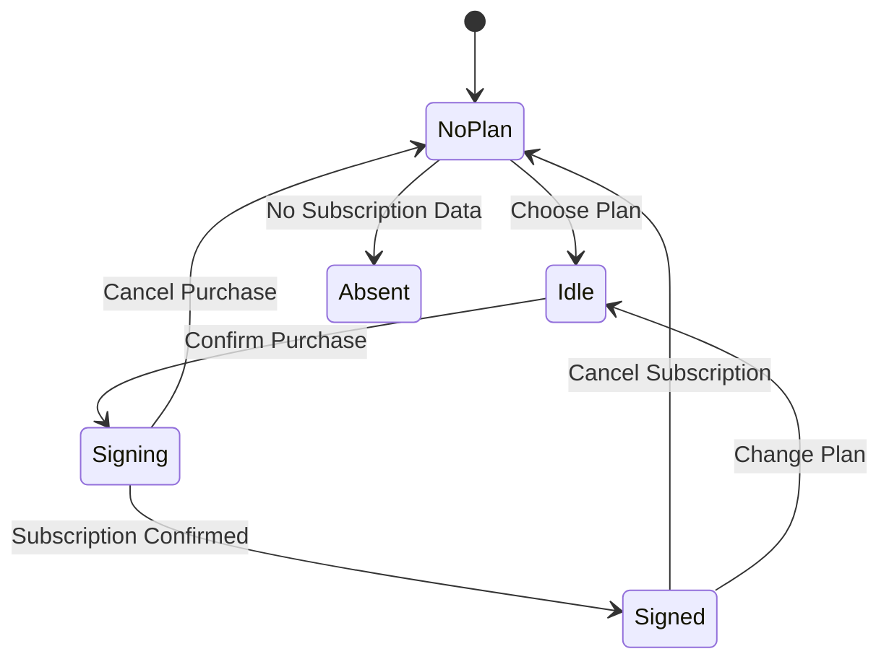

# Plans

## Purpose of Plans
   Plans provide users with different service options.
   Each plan is defined within a preconfigured score.
   Each provider can create their own plan, however partners are restricted to a predefined mapping of available plans per user type (excluding “guest” and “admin”).
   The number of plans per provider is unlimited
   Plans are a way to structure user attributes while maintaining compliance with state flow logic.

## Subscription and User Status
   Users can acquire a service plan or remain without one.
   Users are transferred to an idle state before confirming a plan purchase.
   When a user subscribes, their status changes to signing until confirmation.

   Users can be in one of three sub_status values:
   * **Signed**: confirmed subscription
   * **Unsigned**: not subscribed
   * **Absent**: no relevant subscription data

   These values cannot be changed manually via requests.

## Plan Configuration via API
   Plans can be created, modified, and deleted.
   Requests for plan changes require Basic authentication.
   Information requests for plans support:
   * Optional identifiers
   * Pagination
