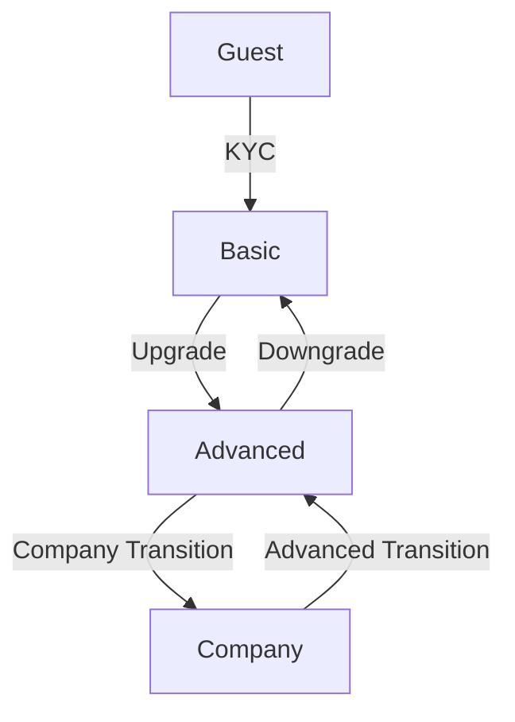

# Users

## User Types and Access Control

The system supports multiple types of end-users, whose availability is determined per partner. Each user type has specific session duration and operation limits.

| User Type     | Session Limit | Daily operation limit | Weekly operation limit | Comment                                                              |
|---------------|---------------|-----------------------|------------------------|----------------------------------------------------------------------|
| Guest         | 20 minutes    | 5                     |                        | Once the limits are reached, the user transitions to the idle state. |
| Basic User    | no limit      | 20                    | 50                     | Requires completing KYC (Know Your Customer)                         |
| Advanced User | no limit      | no limit              | no limit               |                                                                      |
| Company       | no limit      | no limit              | no limit               |                                                                      |
| Admin         |               |                       |                        |                                                                      |

## User Type Flow

## User Service States
User statuses and states define their capabilities within the system.

The status parameter defines the current state of a user in the system:
* **Active** — a user can actively use the system.
* **Inactive** — a user cannot use the system.
* **Idle** — a guest user is set to this restricted state once they reached usage limits. They will automatically transfer to **active** state when limits are reset.
  {id=idle}
## User Statuses
A user can subscribe to one of the available [plans](Plans.md) assigned to their provider.
State transitions related to plan subscriptions:

When subscribing, the user's status temporarily changes to **signing** until confirmation.

After subscribing, an additional attribute **sub_status** is added, which can be:
* **Signed** – subscription is active.
* **Unsigned** – subscription is disabled.
* **Absent** – the user has no subscription.

>The **sub_status** cannot be manually modified via API; it is automatically updated based on subscription actions.